<h1 align="center">SellCycle</h1>


[View the live project here](https://sell-app-cycle-f7894996863d.herokuapp.com/)


SellCycle is an online website for buying, selling, and exchanging new and secondhand clothing, accessories, and more. 
It offers users a convenient way to declutter their closets, discover fantastic deals, and give preloved items a new lease on life. With a focus on sustainability, SellCycle promotes an eco-friendly shopping experience that benefits both individuals and the planet.


# Index

1. [User Experience (UX)](#user-experience-ux)
2. [Features](#features)
3. [Design](#design)
4. [Planning](#planning)
5. [Technologies Used](#technologies-used)
6. [Testing](#testing)
7. [Deployment](#deployment)
8. [Credits](#credits)

# User Experience(UX)

 ### User stories :

*  Navigate site
   - As a **Site User** I can **view the item listed** so that **I can easily access application functionality**
*  View products list
   - As a **Site User** I can **view a list of products** so that **I can select one to access more details or purchase**
*  View item information
   - As a **Site User** I can **click on a product** so that **I can view its full details**
*  View the categories section
   - As a **Site User** I can **access a list of categories of items** 
*  Delete/Edit a product listed
   - As a **Site User** I can **delete or edit an listed item** The user can select a product to edit.
*  Contact seller
   - As a **Site User** I can **contact the seller** so that **I can give ask for more information**
*  View past conversations
   - As a **Site User** I can **view past conversations** so that I can stay in contact**with the customers**
*  Account registration and login
   - As a **Site User** I can **add item and description**of the product  **that I want to sell**
* Catalogue
  - As a **Site User** I can **access a catalogue of products** so that **I can see products I have previously added**
*  Manage stock
   - As a **Site Admin** I can **create, read, update and delete items** so that **I can manage site content and  availability**
*  Conversation
   - As a **Site Admin** I can **review the messages** so that **unsuitable or objectionable content can be deleted**
*  Add items 
   - As a **Site Admin** I can **add items and images** so that **I can finish writing the content later and release once approved**


## Wireframes

To follow best practice, wireframes were developed for mobile, tablet, and desktop sizes.
I've used Balsamiq to design my site wireframes.

[Balsamiq](https://balsamiq.com/wireframes) 
  


### Desktop Wireframes

<details>
<summary>Click here to see the Desktop Wireframes</summary>
<summary> Home Page Unregistred user view</summary>
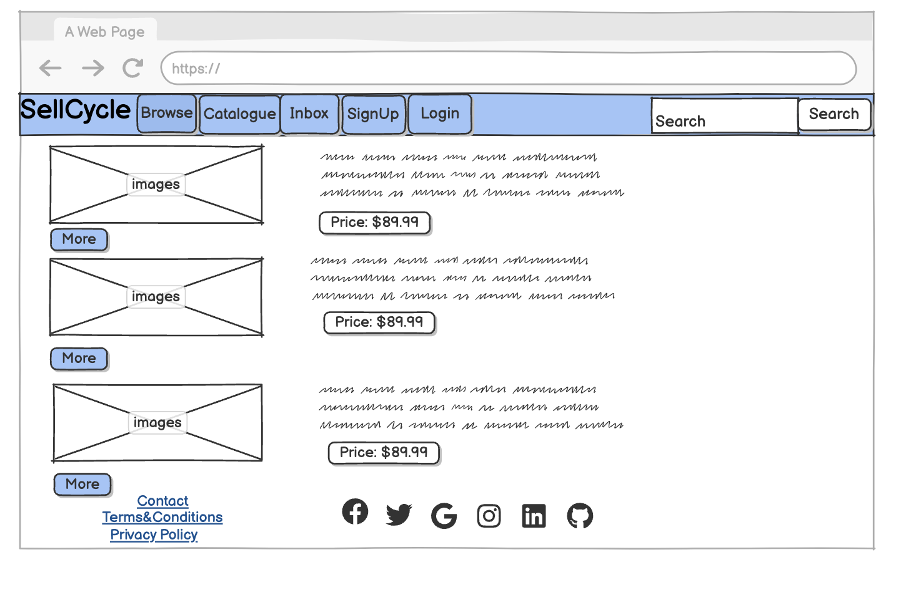
<summary> Home Page  user registred view</summary>
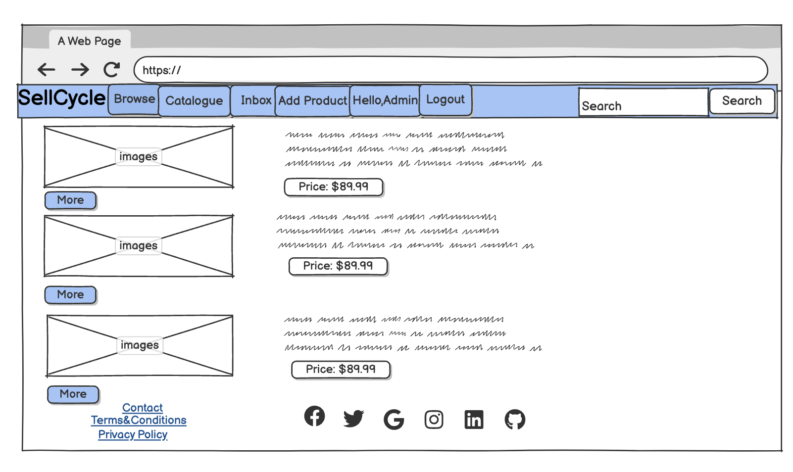
<summary> Add Product page</summary>
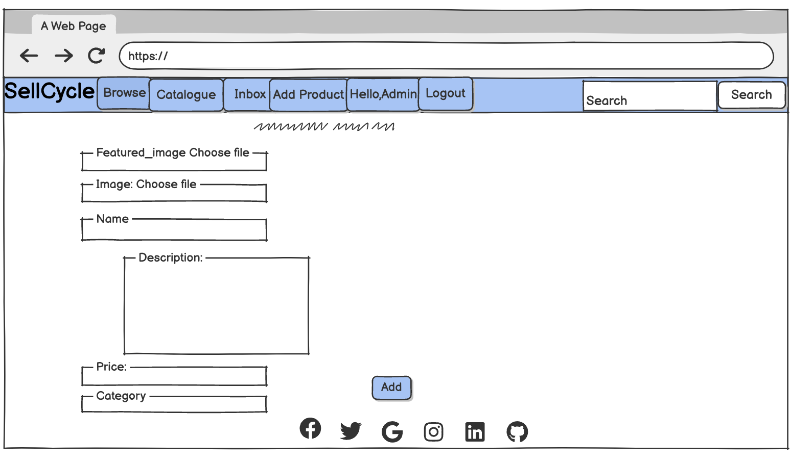
<summary>Inbox</summary>
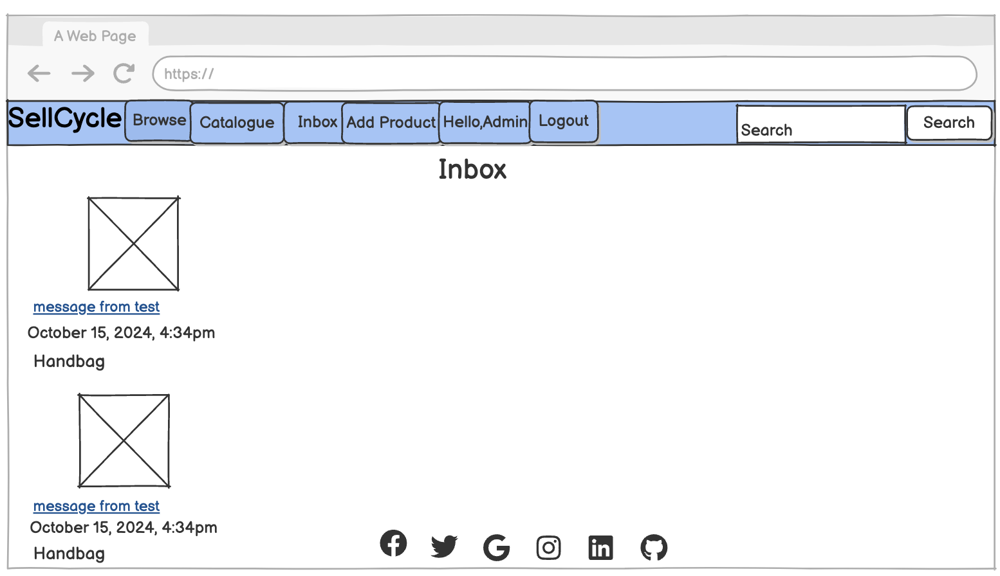
<summary>Message Page</summary>
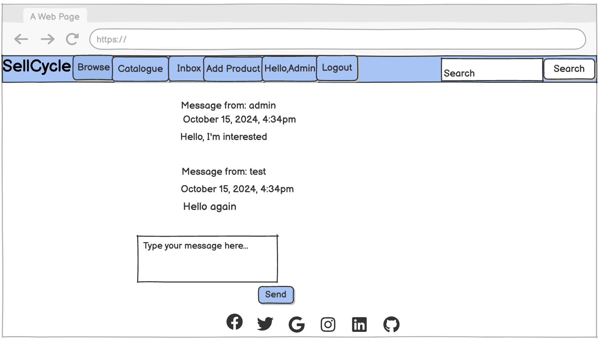
<summary>Catalogue Page</summary>
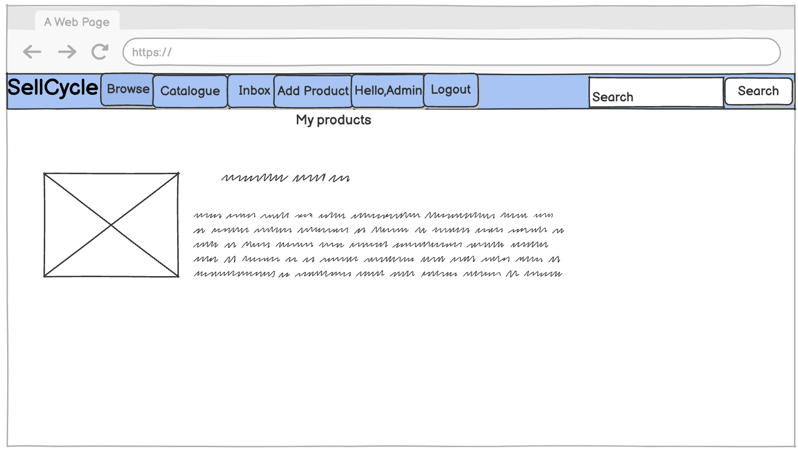
<summary>Browse Page</summary>
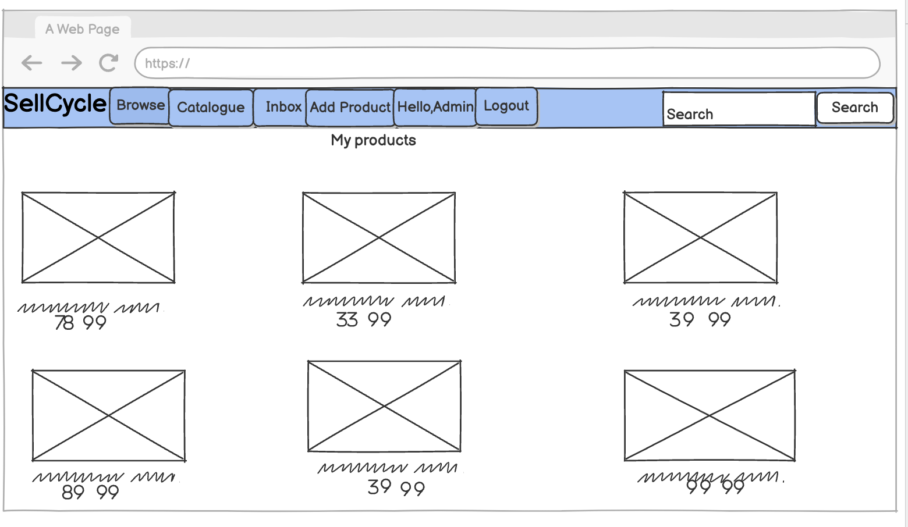
</details>

### Tablet Wireframes

<details>

<summary>
Click here to see the Tablet Wireframes
</summary>
</details>


## Mobile Wireframes

<details>

<summary>
Click here to see the Mobile Wireframes
</summary>

</details>


##  Features
- SellCycle is a comprehensive web application developed using the Django framework, designed to provide a user-friendly platform for individuals looking to buy and sell second-hand items. This project enables users to easily add items for sale, browse available listings, and engage with other users. With an intuitive interface, sellers can efficiently manage their listings  while buyers can search, filter, and find great deals on pre-owned products. Users have the ability to **create**, **read**, **update**, and **delete** their listings, as well as manage their accounts seamlessly.

### Navigation Bar

 - Consistent Design: The navigation bar provides a cohesive design and layout across all pages, ensuring easy access to essential sections of the site.
 - Quick Navigation: It includes the SellCycle logo and a link to the homepage for fast navigation.
 - User Authentication: For users who are not logged in, options to register or log in are clearly displayed. Once logged in, the navigation bar updates to show the 
   Catalogue as well as add products along with a personalized greeting that includes the user’s name and a profile icon.
 - Responsive Design: The navigation bar is optimized for responsiveness, adapting seamlessly to various screen sizes. On mobile devices, it transforms into a compact 'hamburger' menu, allowing effortless navigation without cluttering the interface.
 

### Navigation Bar Views

<details>
<summary>Unregistered User Navigation Bar View</summary>

</details>

<details>
<summary>Registered User Navigation Bar View</summary>

</details>

<details>
<summary>Burger Menu View</summary>

</details>


### User Authentication (SignUp, Login, Logout)

- User authentication methods have been integrated to ensure that users can only list items for sale if they are logged in. Existing users must log in to access the selling features, while new users can easily register before making a listing request.

Dedicated login and logout pages provide a secure authentication experience. If a user attempts to log in with an incorrect username or password, immediate on-screen feedback is given, prompting them to enter the correct credentials. Additionally, a required feature ensures that users must fill in both the username and password fields, preventing incomplete submissions and enhancing overall security.

<details>
<summary>Sign Up or Login  to be able to add items</summary>

</details>

<details>
<summary>Login/Logout Forms</summary>


</details>

<details>
<summary>Existing user alert</summary>

</details>


### Landing Page


<details>
<summary>Landing Page</summary>

</details>

 At the top of the landing page, a striking area showcases a vibrant image of diverse products available for buying and selling. This compelling visual communicates SellCycle's purpose as a dynamic platform for facilitating seamless transactions. The branding prominently features the SellCycle name, reinforcing the site's mission to connect users in a convenient and intuitive marketplace experience.


### Add items

<details>
<summary>Add items</summary>

</details>

When an authenticated user logs into their account, they gain access to a streamlined interface that allows them to easily add items they wish to sell. This feature empowers users to list their products quickly, with a user-friendly form guiding them through the process. Users can upload images, provide detailed descriptions, set prices, and manage their listings effortlessly, making it simple to showcase their items to potential buyers.


### Listing Items

Item Listing System
The item listing page features an eye-catching image of the product alongside a detailed description and associated pricing information. When a user wants to list an item for sale, they must provide their Name, Category , Price, and any additional required information about the item they wish to sell.
An  "Add" button is prominently displayed at the bottom of the form, allowing users to finalize their item listing.


###  CRUD Functionality for Listings

The Create, Read, Update, and Delete (CRUD) functionality is crucial for managing user listings on SellCycle. After logging in, users have access to buttons that allow them to edit or delete their listings. They can also view their current listings at any time.

- **Edit Button**: If a user wishes to change the details of their listing, an Edit button is readily available. Upon clicking this button, users can modify the listing information, and once confirmed, the updates are applied immediately.

- **Delete Button**: Users can also easily remove their listings by clicking the Delete button. This functionality ensures that users have full control over their items and can manage their listings efficiently.

This streamlined process enhances user experience by providing intuitive options for managing listings directly from their account dashboard.

### Inbox

<details>
<summary>Message the seller</summary>

</details>

 The **inbox feature** is an essential component of our platform, providing users  the chances to communicate seamlessly regarding their transactions. This feature allows buyers and sellers to send and receive messages, facilitating inquiries about listings, negotiations on prices, and coordination for pick-up or delivery. The inbox is designed with user privacy in mind, allowing for secure communication while enhancing the overall buying and selling experience. 


### Catalogue 

<details>
<summary>Catalogue</summary>

</details>

The **catalogue feature** provides users with an organized and visually appealing way to browse a wide range of second-hand items. It allows buyers to filter and sort listings by categories, price, and more, ensuring a seamless shopping experience. Each item includes detailed descriptions and high-quality images, helping users make informed decisions. Regular updates keep the catalogue fresh, encouraging users to explore the latest offerings and enhancing overall engagement on the platform.


### Browse 

<details>
<summary>See products and their prices listed </summary>

</details>

The **browse feature** allows users to easily explore a wide variety of second-hand items available for sale. With intuitive navigation and filtering options, buyers can quickly find products that match their interests and needs. This feature supports seamless scrolling through listings, showcasing high-quality images and essential details for each item. By making the discovery process effortless, the browse feature enhances user engagement and encourages more interactions within the marketplace.


### Categories

<details>
<summary>See the available categories  </summary>

</details>

 The **categories feature** organizes listings into distinct groups, making it easier for users to navigate and find specific types of second-hand items. By categorizing products—such as women, mens, kids, can quickly hone in on their interests. Users can effortlessly explore and discover items that suit their needs.


### SellCycle: PostgreSQL Database & Super User Creation

The admin interface of SellCycle offers a user-friendly graphical user interface (GUI) for managing data related to selling and adding items. Administrators can easily create, read, update, and delete product listings and conversations without needing direct access to the database. They can add new items across categories such as Women, Men, and Kids, complete with relevant details like price, description, and featured images. Additionally, admins can manage conversations between users, modifying or deleting them as necessary.

Non-technical users, such as business managers and customer service representatives, can navigate the Django admin interface without needing to understand the underlying code. The auto-generated forms make it straightforward to add, edit, or remove entries.

### Database Integration:

### SellCycle: Admin Functionality for Managing Listings

The admin user can add and publish items through the admin pages of SellCycle. These pages are accessible either by appending '/admin' to the application URL or by signing in and clicking the Admin link, which appears in the navigation bar only when the admin is logged in.
To add a new item, the admin can click the "+ Add" link next to the table name and then fill in the required data fields. A rich text editor (Summernote) is provided for the item description, allowing for easy formatting. If the admin user does not upload an image, a default image will be used for the item. This functionality streamlines the process of managing listings and ensures a consistent presentation on the platform.

<details>
<summary>User interactions managed through the Django admin panel</summary>

</details>


<details>
<summary>The admin user can select the category and add items</summary>

</details>


 <details>
<summary> Admin effectively handling conversations</summary>

</details>


### SellCycle: Responsive Design with Bootstrap

Responsive design ensures that SellCycle functions seamlessly across all devices, from desktops to smartphones. By leveraging Bootstrap, the website automatically adapts its layout and appearance based on screen size, providing a consistent user experience. Below are key aspects of how Bootstrap enhances responsiveness and builds user trust.

**Navbar**: The navbar-toggler feature collapses the menu on smaller screens, improving usability for mobile users. This ensures that navigation remains straightforward, regardless of device.

**Container-fluid**: This class guarantees that content adjusts fluidly to various screen widths. Bootstrap’s grid system (e.g., col-md-8, offset-md-2) organizes elements effectively, maintaining proper spacing and alignment.

**Form Styling**: User experience and accessibility are prioritized with Bootstrap form controls (form-control, form-group), ensuring that all forms are consistently styled and responsive across devices.

**CSRF Token**: Security is paramount, with Django’s CSRF protection implemented to safeguard forms from malicious attacks.

**Button Styling**: Actionable elements like "Sign in" are styled with Bootstrap's btn classes, making them easily recognizable and engaging.

**Font Awesome Icons**: The use of icons, such as user and social media icons, enhances visual interest and usability throughout the site.

**Branding**: A custom logo and favicon reinforce brand identity, contributing to a cohesive user experience.

**Content Focused on Trust**: Building trust is essential for user engagement. SellCycle fosters trust through:

- **Clear Navigation**: The navbar directs users to vital pages like "Sign in," "Sign Up," and "My Items," promoting transparency and ease of access.
- **Personalized Experience**: Displaying the logged-in user’s name (e.g., Hi, {{ user.username }}) in the navbar reassures users of their secure session.
- **Social Proof**: Links to social media profiles, such as GitHub, LinkedIn, and Twitter, demonstrate the company's connections to reputable networks.
- **Secure Practices**: Implementing user authentication and form validation enhances credibility and user confidence.


### How Existing Features Address User Stories

The User Stories in the User Experience (UX) section of this document are numbered from 1 to 10, while the existing features are labeled as F01 to F07. Below is a traceability matrix that cross-references the user stories with the corresponding features, demonstrating how each feature supports specific stories:


<details>
<summary>Traceability Matrix Graphic</summary>

</details>


###  Features which could be implemented

*Buy Integration for User Items*
- Implementing a buy integration feature on SellCycle will enable users to purchase items directly through the platform, creating a seamless shopping experience. This feature is essential for facilitating transactions between buyers and sellers efficiently.


*Instant Checkout*

- A streamlined checkout process that minimizes steps, enabling users to complete their purchases swiftly. This includes reviewing item details, confirming shipping information, and selecting payment options.

*Inventory Management*

- Real-time updates to item availability to ensure users can only purchase items that are in stock, reducing the risk of overselling.

*Order Confirmation*

- Automated email or in-app notifications confirming the purchase details, including item description, price, and estimated delivery time, to enhance user trust.


*Like/Unlike Functionality for User Items*

- Implementing a like/unlike feature for items added by users can significantly enhance engagement on SellCycle. This feature would allow users to express their appreciation for items by clicking a "like" button. Each user would have the ability to like or unlike items, with the status being tracked in the database to ensure accurate counts and user interactions.

*Shopping Cart Functionality for User Items*

- Introducing a cart feature for user-added items on SellCycle can enhance the shopping experience significantly. This feature would allow users to save items they’re interested in purchasing, facilitating a smoother transaction process.

*Payment Integration for Users*

- Implementing a payment integration feature for user-added items on SellCycle will streamline the purchasing process and enhance user convenience. This feature would allow users to complete transactions directly through the platform, making it easier to buy items they are interested in.

*Transaction History*

- A section in user profiles where they can view their past purchases and payment history, adding transparency and convenience.

*Loyalty and Referral Programs*

- Introducing loyalty and referral programs on SellCycle can enhance user engagement and encourage repeat transactions. These features would reward users for their activity on the platform, fostering a sense of community and encouraging word-of-mouth promotion.

## Entity-Relationship Diagram (ERD)

<details>
<summary>ER diagram:</summary>

</details>


### Notes on the ER diagrams :
- User: Represents the customer who adds the items. This is a foreign key referencing Django's built-in User model.
- Listing: Represents different categories available for selling an item, such as "Women", "Mens", and "Kids". Each item has attributes such as:

  - category: The type of item being sold.
  - price: The cost of the item.
  - description: Details about the item.
  - featured_image: Image associated with the item.
  - image: An optional image 
- Product: Represents a product available for sale. Key attributes include:
  - category: Links the product to a specific category using a foreign key.
  - name: The name of the product.
  - featured_image: An optional image associated with the product, uploaded using Cloudinary.
  - description: Details about the product; this can be blank or null if no description is provided.
  - image: An additional optional image for the product, also uploaded using Cloudinary.
  - price: The cost of the product.
  - is_sold: A boolean indicating whether the product has been sold.
  - created_at: Automatically set to the current date and time when the product is created.
  - created_by: Links the product to the user who created it using a foreign key.

- Relationships
   - User to Product: This is a one-to-many relationship. A user can create multiple products, but each product is associated with one user.

   - Category to Product: This is a one-to-many relationship. A category can have multiple products, but each product belongs to one category.
   Product to Category: one-to-many . Each product is linked to one category via the category foreign key. A single category can have multiple products associated with it. This relationship helps organize products, allowing users to filter and browse items by category. The related_name='products' allows for easy access to all products in a specific category.
  
   - Product to User: one-to-many relathionship. Each product is associated with one user through the created_by foreign key. A user can create multiple products, but each product belongs to a single user. This relationship enables users to manage their own products. The related_name='products' allows access to all products created by a specific user.


- Benefits of This Structure
  - Organization: The relationships and unique constraints create a well-structured database. This organization allows for efficient querying and management of products.

  - Data Integrity: The unique constraint prevents duplicates, ensuring that the product catalog remains clear and easy to navigate.
  The foreign key relationships ensure that the database remains consistent, as deleting a category or user also cleans up associated products.

  - User Management: Linking products to users allows for personalized experiences where users can manage their own products and view their inventory.

  - Foreign Key Constraints:

Description: The foreign keys (category and created_by) ensure that each product must be associated with a valid category and user. If a category or user is deleted, all associated products will also be deleted due to on_delete=models.CASCADE. This maintains referential integrity in the database. Ensures that a product cannot exist without a valid category and creator, preventing orphaned records.

The Product model effectively manages relationships and constraints to ensure data integrity and usability within the application. By linking products to categories and users, it provides a structured way to handle inventory while maintaining referential integrity.
## Technologies Used

### Languages Used

-   [HTML5](https://en.wikipedia.org/wiki/HTML5)
-   [CSS3](https://en.wikipedia.org/wiki/Cascading_Style_Sheets)
-   [Jquery](https://jquery.com/)
-   [Python](https://www.python.org/)

### Frameworks, Libraries & Programs Used

### Technologies Used

- **Google Fonts:** Implemented the Josefin Sans font to enhance the site's typography.
- **Font Awesome:** Incorporated to provide icons that improve both aesthetics and user experience.
- **Git:** Utilized for version control, employing the Gitpod terminal for committing changes and pushing updates to GitHub.
- **GitHub:** Acts as the project's code repository, facilitating agile development through User Stories (GitHub Issues) and tracking progress on a Kanban board.
- **dbdiagram.io:** Used to create Entity Relationship diagrams that represent the application’s data model.
- **Balsamiq:** Applied to design wireframes during the planning phase, aiding in the visual structure of the application.
- **Django:** The framework chosen for its ability to support rapid and secure application development.
- **Bootstrap:** Used to create responsive web pages, ensuring a seamless experience across devices.
- **Gunicorn:** The web server selected to run the Django application on Heroku.
- **dj_database_url:** A library that simplifies the connection to PostgreSQL databases through URL configuration.
- **psycopg2:** The database adapter that enables communication with PostgreSQL databases.
- **Cloudinary:** Utilized for storing and managing images used throughout the application.
- **Summernote:** Integrated for rich text editing capabilities in the "ADDITIONAL TEXT" field when users create or edit bookings.
- **Django Allauth:** Employed to manage user registration and authentication processes effectively.
- **Django Crispy Forms:** Facilitates cleaner and more efficient form rendering.
- **jQuery:** Utilized to enhance user interactions by fading out alert messages smoothly.
- **Django Testing Tools:** Used for testing the application’s Model-View-Template (MVT) architecture to ensure reliability.

### Agile Development with Github

- For the SellCycle project, GitHub Issues served as the Agile management tool. User Stories, complete with acceptance criteria, were defined and tracked through GitHub Issues, while development progress was organized using a Kanban board. Each User Story was linked to a 'parent' Epic issue, illustrating how they contribute to the project's overarching objectives. Acceptance criteria were rigorously tested as each story progressed to the 'Done' column, and they were also included in the comprehensive manual testing outlined in the Testing section of this README.
You can access the Epic, User Stories, and Kanban board here: [Kanban Board](https://github.com/users/Esty-8/projects/9)

### Testing

- HTML Validation

Since this project utilizes Django templates, the HTML has been validated by manually executing the application pages, copying the source of the rendered pages, and then validating this version of the HTML using the [W3C Validator](https://validator.w3.org). The HTML for the Django admin site pages was not edited, so it has not been validated here. The Signup/Registration form, Login, and Logout pages from Django Allauth were remodeled and have been validated, with results provided below.There were a few  issues encountered during the validatotion process which didn't resulted in the code not fully validated.

<details>
<summary> Validation result for foundation.html
</summary>

</details>

<details>
<summary>Validation result for login.html</summary>

</details>

<details>
<summary>Validation resign for Sign In Page </summary>

</details>


<details>
<summary> Validation result for Catalogue  Page</summary>

</details>


<details>
<summary> Validation result for Browse Page</summary>

</details>

<details>
<summary>Validation result for Inbox Page</summary>

</details>


### CSS Validation
- [CSS Validator](https://validator.w3.org/nu/#textarea)


<details>
<summary>Validation result for the CSS</summary>
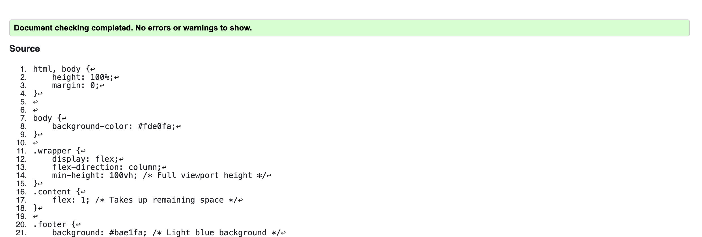
</details>


### Python Validation
- [Python Validator](https://pep8ci.herokuapp.com/)

<details>
<summary>Validation result for the Apps</summary>
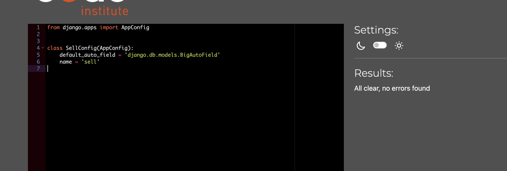
</details>


<details>
<summary>Validation result for the Views.py</summary>
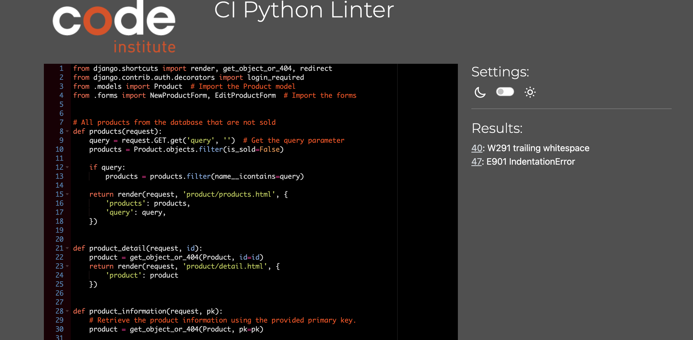
</details>

<details>
<summary>Validation result for the Urls</summary>
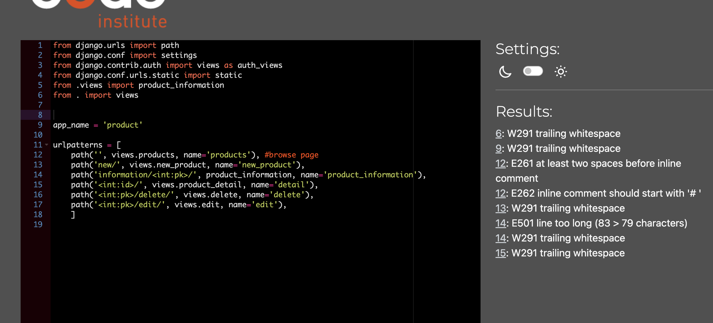
</details>

<details>
<summary>Validation result for the Models</summary>
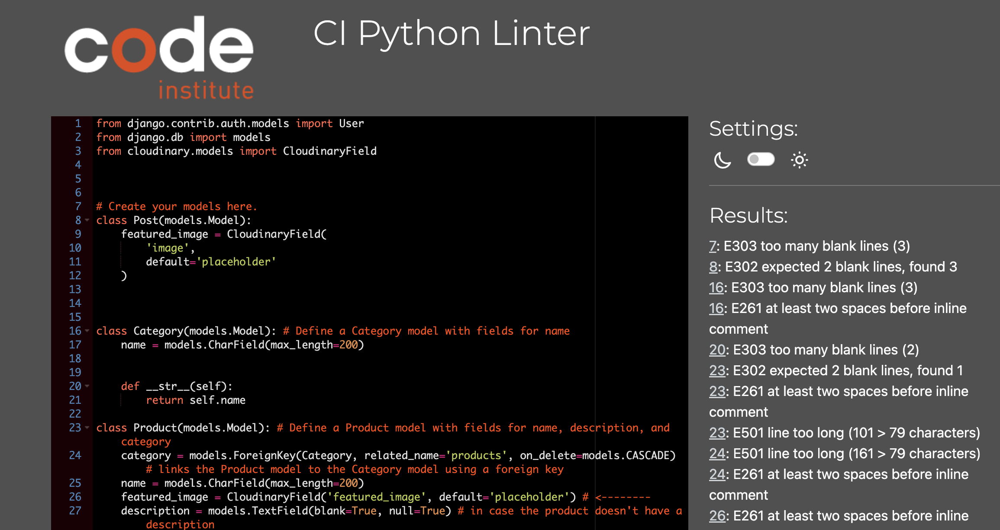
</details>

<details>
<summary>Validation result for the Forms</summary>
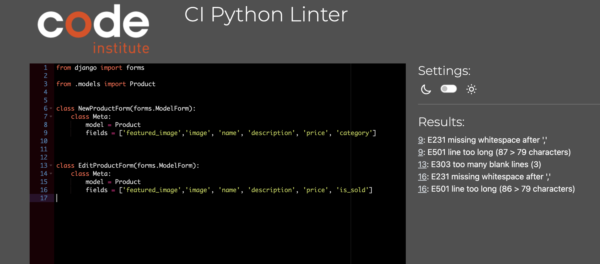
</details>


<details>
<summary>Validation result for the Admin</summary>
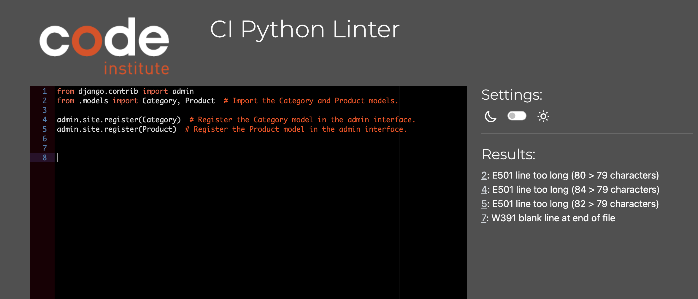
</details>


### Browser Compatibility Testing Report

#### Overview
To ensure optimal user experience across various devices and browsers, the application was tested for responsiveness and compatibility. The following browsers and versions were utilized for testing:

#### Testing Environment
- **Chrome DevTools**: Used for testing responsiveness on different screen sizes.
  
#### Browsers Tested
1. **Google Chrome**
   - Version: 9.0.4606.81 (64-bit)
   - Notes: The application displayed well on various screen sizes, with no major issues identified.
   
2. **Firefox**
   - Version: 93.0 (64-bit)
   - Notes: Functionality and layout remained consistent across different resolutions.
   
3. **Microsoft Edge**
   - Version: 94.0.992.38 (64-bit)
   - Notes: Performance was stable, with the interface adapting correctly to various screen sizes.

#### Key Findings
- **Responsiveness**: The application maintains a responsive layout across all tested browsers. Elements resize and reposition appropriately based on screen size.
- **Cross-Browser Functionality**: No significant discrepancies were found in functionality between the tested browsers.
- **User Experience**: Overall, the user experience is consistent, ensuring that users can navigate and interact with the application seamlessly regardless of the browser used.

#### Recommendations
- Regularly update browser versions during testing as new updates may introduce compatibility issues.
- Consider expanding testing to include additional browsers (e.g., Safari, Opera) and mobile browsers to ensure broader compatibility.

This testing confirms that the application is robust and user-friendly across the specified environments.

## Manual Testing Test Cases and Results

- 
- 

### How to Clone the Repository

To clone this repository and set up the application locally, follow these steps:

1. **Navigate to the GitHub Repository**: Go to [this link](https://github.com/Esty-8/sell-cycle).

2. **Copy the Repository URL**: Click on the "Code" button, select HTTPS, and copy the provided URL.

3. **Open Your Terminal**: Launch your GitBash terminal and navigate to the directory where you want to store the cloned project.

4. **Clone the Repository**: Run the following command in the terminal:
   ```bash
   git clone https://github.com/Esty-8/sell-cycle
   ```
   Press Enter to start the cloning process.

5. **Install Dependencies**: Use the command below to install the necessary dependencies for the application:
   ```bash
   pip install -r requirements.txt
   ```

6. **Set Debug Mode**: While developing or running the app locally, ensure that `DEBUG=True` is set in the `settings.py` file.

7. **Push Changes Back to GitHub**: To push any modifications made to the cloned repository, follow these steps:
   - **Add Modified Files**: Use `git add <filename>` for specific files or `git add .` to include all changed files.
   - **Commit Changes**: Commit your changes with a descriptive message:
     ```bash
     git commit -m "description of changes"
     ```
   - **Push Changes**: Finally, push the changes to the repository:
     ```bash
     git push
     ```

   **Note**: Any updates pushed to the master branch will be reflected in the live application once it is redeployed from Heroku.


### Deployment

Below are the steps to clone this project repository, along with the necessary configurations and deployment procedures. You can find a summary of similar steps in the CI Cheat Sheet provided by Code Institute.

1. **Cloning the Repository**: Instructions for cloning this project repository.

2. **Setting Up the Application and PostgreSQL Database on Heroku**: Guidance on creating the application and configuring the PostgreSQL database on Heroku.

3. **Configuring Cloudinary**: Steps to set up Cloudinary for hosting images used in the application.

4. **Linking the Heroku Application to the GitHub Repository**: Instructions for connecting the Heroku app to the GitHub repository to streamline deployments.

5. **Final Deployment Process**: A walkthrough of the final steps needed for successful application deployment.


### Create Application and Postgres DB on Heroku

1. **Log into Heroku**: Go to the [Heroku website](https://www.heroku.com) and log in to your account.

2. **Create a New Application**: In the Heroku dashboard, click the **Create new app** button. If you're a new user, you’ll see a prompt to create an app. If not, select **New** from the dropdown menu in the top right corner and click **Create a new app**.

3. **App Configuration**: On the **Create New App** page, enter a unique name for your app and select a region. Then click **Create app**.

4. **Add Postgres Database**: After creating the app, navigate to the **Resources** tab. In the **Add-ons** section, search for **Heroku Postgres**. Select it from the list and click **Submit Order Form** in the dialog that appears.

5. **Configure Environment Variables**: Next, go to the **Settings** tab and click **Reveal Config Vars**. Verify that the `DATABASE_URL` has been automatically configured.

   - Add a new Config Var called `DISABLE_COLLECTSTATIC` and set its value to `1`.
   - Add another Config Var named `SECRET_KEY` and assign it a random string of characters (letters, numbers, and symbols).

6. **Update `settings.py`**: Modify your `settings.py` file to use these environment variables for database configuration and secret key management:
   ```python
   DATABASES = {'default': dj_database_url.parse(os.environ.get('DATABASE_URL'))}
   SECRET_KEY = os.environ.get('SECRET_KEY')
   ```

7. **Migrate the Database**: In your Gitpod terminal, initialize the database schema by running the migration command:
   ```bash
   python3 manage.py migrate
   ```

8. **Update Requirements**: Ensure your `requirements.txt` file includes all necessary dependencies by running:
   ```bash
   pip3 freeze --local > requirements.txt
   ```

9. **Commit and Push Changes**: Push any local modifications to GitHub by committing and pushing as usual:
   ```bash
   git add .
   git commit -m " Heroku deployment"
   git push
   ```

10. **Run the Application Locally**: To run the app on localhost, ensure that the `SECRET_KEY` and `DATABASE_URL` environment variables are set in your `env.py` file.

### App Creation on Heroku Dashboard
*Steps for connecting Postgres DB on Heroku have been outlined above.*

<details>
<summary>App created on Heroku</summary>
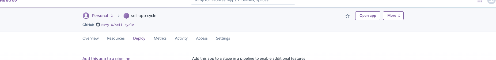
</details>

<details>
<summary>Connecting Postgress DB on Heroku</summary>

</details>

### Configure Cloudinary for Hosting Application Images

1. **Sign Up for Cloudinary**: Go to the Cloudinary website and create an account if you haven’t already. During the registration process, provide your name, email address, and create a password. When asked about your "primary interest," select **Programmable Media** for image and video APIs. After completing the sign-up, verify your account using the confirmation email you receive. This will give you access to your Cloudinary dashboard.

2. **Obtain the API Environment Variable**: In your Cloudinary dashboard, find the API Environment variable and copy its value by clicking the **Copy to clipboard** button.

3. **Configure Cloudinary on Heroku**: Log into your Heroku account and go to your app’s **Settings** section. Click **Reveal Config Vars** to view and manage environment variables. Add a new Config Var named `CLOUDINARY_URL` and paste the value you copied from Cloudinary, making sure to remove the "CLOUDINARY_URL=" prefix before saving.

4. **Prepare for Local Deployment**: To run the application locally, add the `CLOUDINARY_URL` and its value to your `env.py` file, allowing your application to utilize Cloudinary while running on localhost.

### Cloudinary Media Upload Dashboard
*Access your Cloudinary dashboard for managing media uploads and configurations.*

<details>
<summary> Cloudinary Media Upload Interface</summary>
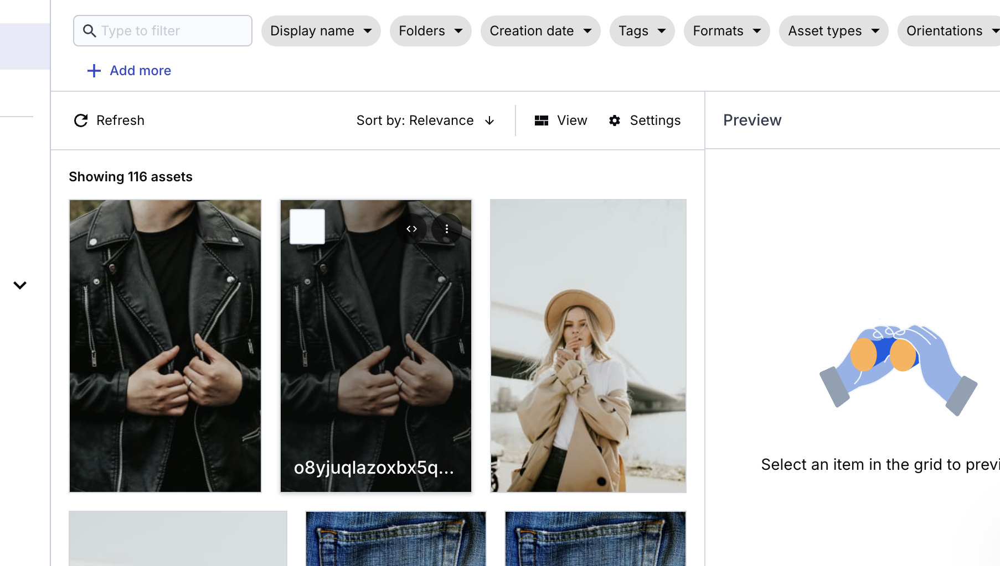
</details>

### Link the Heroku App to the GitHub Repository

1. Go to the "Deploy" tab on your Heroku application configuration page.

2. Select GitHub as your deployment method. If necessary, confirm the connection between Heroku and GitHub.

3. In the search field, type the name of your GitHub repository (for this project, it’s **sell-cycle**) and click **Connect** to associate the Heroku app with your repository.

4. Scroll down to the deployment options. You can choose to enable **Automatic Deploys** (which redeploys the app whenever changes are pushed to GitHub) or select **Manual Deploy** for on-demand deployments. This project uses manual deployment.

5. To launch the application, return to the application configuration page and click the **Open App** button.

<details>
<summary>Connecting the GitHub Repository to the Heroku App</summary>
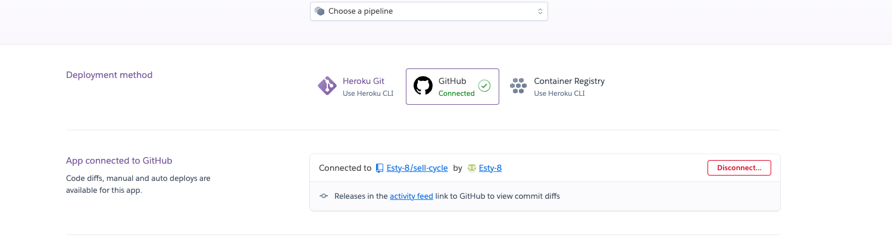
</details>


### Final Deployment Steps

Once you have completed and tested your code changes on localhost, follow these steps to prepare your application for deployment on Heroku:

1. **Set the DEBUG Flag:** Change the DEBUG setting to False in `settings.py`.


2. **Update requirements.txt:** Run the command `pip3 freeze --local > requirements.txt` to ensure that your requirements file is current.

3. **Push Changes to GitHub:** Commit and push your updated files to GitHub.

4. **Collect Static Files:** Before final deployment, run `python3 manage.py collectstatic` to gather all the latest static files, since the DISABLE_STATIC variable has been removed on Heroku.

5. **Deploy on Heroku:** Go to the Deploy tab on the Heroku dashboard for your application and click on "Deploy Branch."

Throughout this process, the Code Institute's "Django Blog Cheat Sheet" served as an essential resource for installing and configuring frameworks and libraries, setting up the database management system (DBMS), and preparing the application for deployment.

You can access the live application here: [SellCycle](https://sell-app-cycle-f7894996863d.herokuapp.com/).


### Media

For icons, I utilized [Font Awesome](https://fontawesome.com), which includes social media links in the footer for platforms like [GitHub](https://github.com), [LinkedIn](https://www.linkedin.com), and [Twitter](https://twitter.com).

The application's favicon logo was created using [Favicon.io](https://favicon.io).

The project mockup was designed with [Am I Responsive?](http://ami.responsivedesign.is).


### Credits

- This README was adapted from the structure provided in [this repository](https://github.com/elainebroche-dev/pf4-wayfarers-guided-hikes/blob/main/README.md) as well as [this repository](https://github.com/TerenceTamuka/handy-man-services-fullstack-project)

- **ChatGPT**: This AI tool assisted in generating ideas for the project website and provided coding ideas to enhance the app's functionality.

- **[Codemy](Codemy.com)** and **[freeCodeCamp](https://www.youtube.com/watch?v=YZvRrldjf1Y&t=865s:)** I watched several Django tutorials on this channel, which greatly contributed to my development process.

- **[Net Ninja](https://www.youtube.com/watch?v=wQPaXedytlg&t=174s)**: This channel helped clarify key concepts related to templates, forms, and models used in this project.