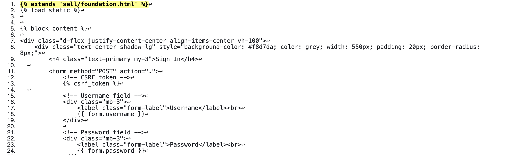

<h1 align="center">SellCycle</h1>

[View the live project here](https://sell-app-cycle-f7894996863d.herokuapp.com/)

SellCycle is an online website for buying, selling, and exchanging new and secondhand clothing, accessories, and more. 
It offers users a convenient way to declutter their closets, discover fantastic deals, and give preloved items a new lease on life. With a focus on sustainability, SellCycle promotes an eco-friendly shopping experience that benefits both individuals and the planet.

# Index

1. [User Experience (UX)](#user-experience-ux)
2. [Features](#features)
3. [Design](#design)
4. [Planning](#planning)
5. [Technologies Used](#technologies-used)
6. [Testing](#testing)
7. [Deployment](#deployment)
8. [Credits](#credits)

# User Experience(UX)

 ### User stories :

*  Navigate site
   - As a **Site User** I can **view the item listed** so that **I can easily access application functionality**
*  View products list
   - As a **Site User** I can **view a list of products** so that **I can select one to access more details or purchase**
*  View item information
   - As a **Site User** I can **click on a product** so that **I can view its full details**
*  Buy a product
   - As a **Site User** I can **see a selection of items** so that **which I can choose from**
*  View the categories section
   - As a **Site User** I can **access a list of categories of items** and purchase the wanted item**
*  Delete/Edit a product listed
   - As a **Site User** I can **cancel a hike I have booked** so that **a place is no longer reserved for me**
*  View likes
   - As a **Site User** I can **view the number of likes on each number** so that **I can see which are most popular**
*  Like / Unlike an item
   - As a **Site User** I can **like or unlike an item** so that **I can increase the product popularity**
*  Contact seller
   - As a **Site User** I can **contact the seller** so that **I can give ask for more information**
*  View past conversations
   - As a **Site User** I can **view past conversations** so that I can stay in contact**with the customers**
*  Approve comments
   - As a **Site Admin** I can **review and then approve or disapprove comments** so that **unsuitable or objectionable content can be filtered out**
*  Account registration and login
   - As a **Site User** I can **add item and description**of the product  **that I want to sell**
*  Manage stock
   - As a **Site Admin** I can **create, read, update and delete items** so that **I can manage site content and  availability**
*  Add items 
   - As a **Site Admin** I can **add items and images** so that **I can finish writing the content later and release once approved**
* Browse items
  - As a **Site User** I can **access a list of items in that past that I added** so that **I can see products I have previously added**

## Wireframes

To follow best practice, wireframes were developed for mobile, tablet, and desktop sizes.
I've used Balsamiq to design my site wireframes.

[Balsamiq](https://balsamiq.com/wireframes) 
  
## Mobile Wireframes

Click here to see the Mobile Wireframes

### Desktop Wireframes

Click here to see the Desktop Wireframes

### Tablet Wireframes

Click here to see the Tablet Wireframes

#  Features

### Navigation Bar

 - Consistent Design: The navigation bar provides a cohesive design and layout across all pages, ensuring easy access to essential sections of the site.
 - Quick Navigation: It includes the SellCycle logo and a link to the homepage for fast navigation.
 - User Authentication: For users who are not logged in, options to register or log in are clearly displayed. Once logged in, the navigation bar updates to show the 
   Catalogue as well as add products along with a personalized greeting that includes the user’s name and a profile icon.
 - Responsive Design: The navigation bar is optimized for responsiveness, adapting seamlessly to various screen sizes. On mobile devices, it transforms into a compact      'hamburger' menu, allowing effortless navigation without cluttering the interface.
  Desktop

### Navigation Bar Views

Unregistered User Navigation Bar View

Registered User Navigation Bar View

Burger Menu View

### Landing Page
- At the top of the landing page, a striking area showcases a vibrant image of diverse products available for buying and selling. This compelling visual communicates SellCycle's purpose as a dynamic platform for facilitating seamless transactions. The branding prominently features the SellCycle name, reinforcing the site's mission to connect users in a convenient and intuitive marketplace experience.

Landing Page

### Future Features

 
 - Users will have CRUD functionality and autonomy on their profiles

- **Browse**

 -
 -

- **Dashboard**
 - 
 - To keep track of the items added.

## Technologies Used

### Languages Used

-   [HTML5](https://en.wikipedia.org/wiki/HTML5)
-   [CSS3](https://en.wikipedia.org/wiki/Cascading_Style_Sheets)
-   [Jquery](https://jquery.com/)
-   [Python](https://www.python.org/)

### Frameworks, Libraries & Programs Used

